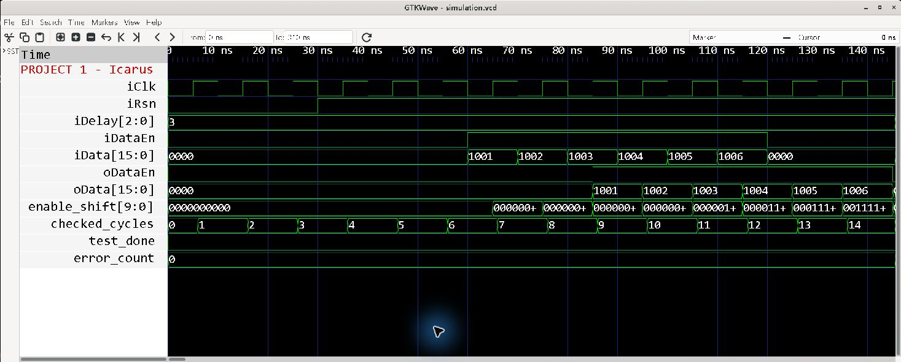
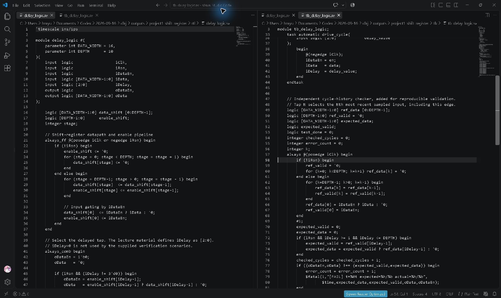
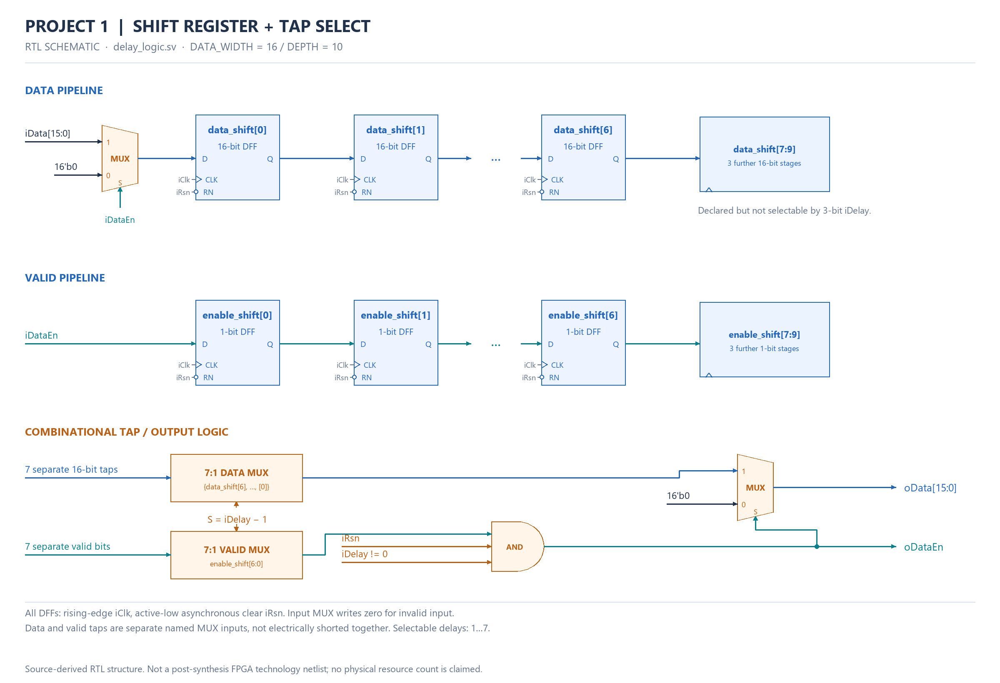
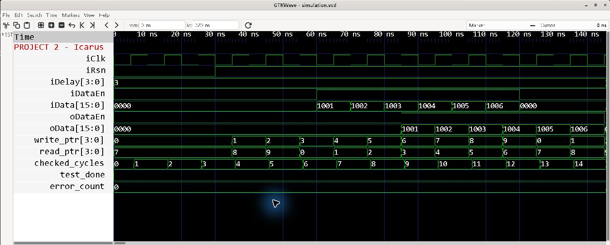
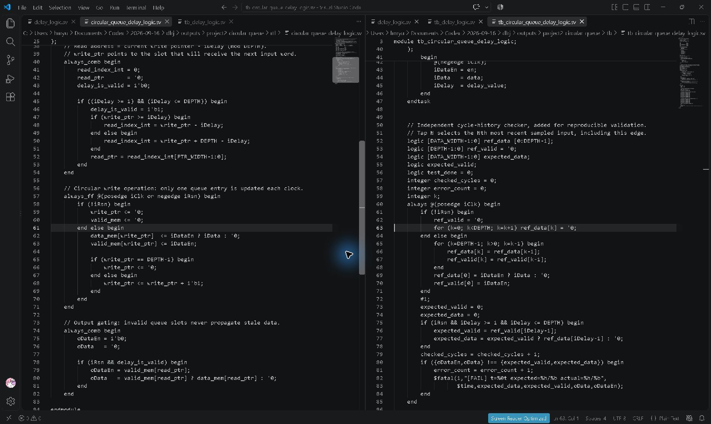
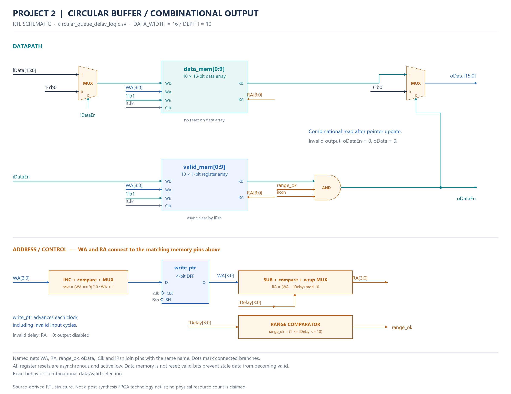
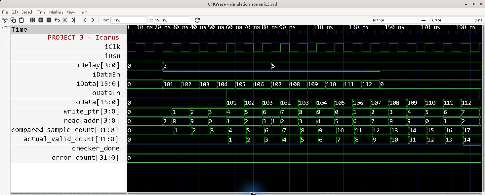
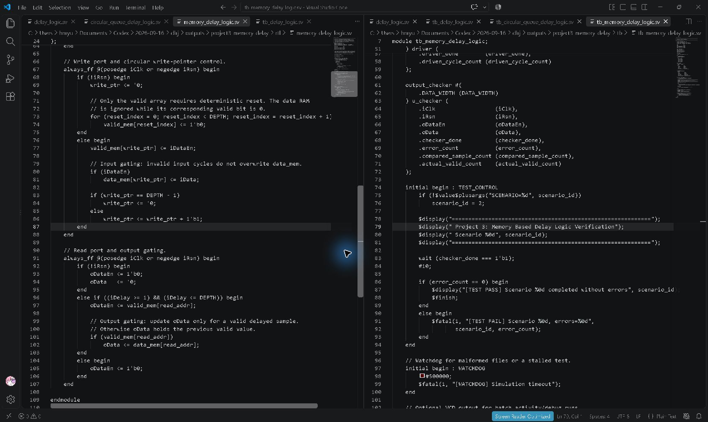
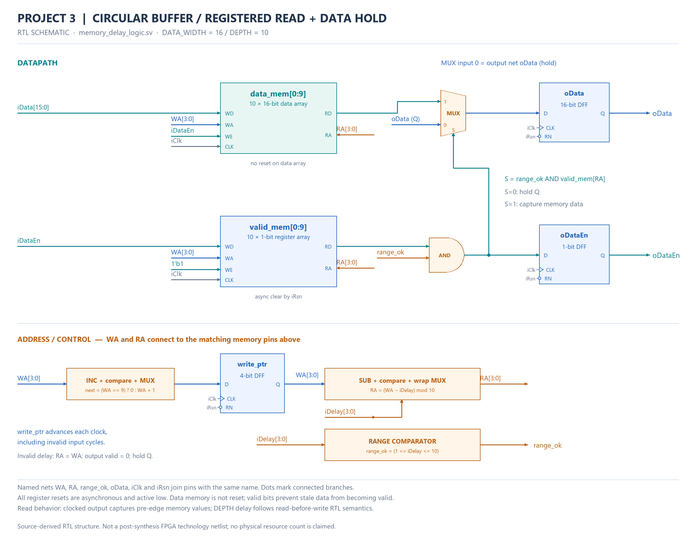

# FPGA Programmable Delay Logic

**Actual free-program screenshots · 2026-09-16**

Icarus Verilog 14.0 → VCD → GTKWave. RTL and testbench are open in the actual VS Code editor.

| Project | Current execution | Errors |
|---|---|---|
| 1: Shift Register | 31 checked cycles PASS | 0 |
| 2: Circular Queue | 32 checked cycles PASS | 0 |
| 3: Memory + Registered Output | 3 scenarios: 8/5, 14/4, 17/14 checked/valid cycles PASS | 0 |

[Reproducible run and source files](runs/2026-09-16/) · [Verification manifest](runs/2026-09-16/verification_summary.json) · [Capture provenance](runs/2026-09-16/capture_manifest.json)

Quartus/ModelSim were not executed in this run. The separately drawn gate/register structures are derived from RTL, not post-synthesis netlists. No new PPA values are claimed.

Project 1/2 select the Nth newest sample including the current edge and output zero when invalid. Project 3 has a registered read with N complete clock periods of latency and holds the previous data when invalid. The current 31/32 checks are separate from the historical 20/26-check regression below.

## Project 1 — Shift Register

[RTL, testbench, raw VCD and logs](runs/2026-09-16/project1_shift_register/)







[gtkwave_full](runs/2026-09-16/project1_shift_register/evidence/gtkwave_full.png)

## Project 2 — Circular Queue

[RTL, testbench, raw VCD and logs](runs/2026-09-16/project2_circular_queue/)







[gtkwave_full](runs/2026-09-16/project2_circular_queue/evidence/gtkwave_full.png)

## Project 3 — Memory + Registered Output

[RTL, testbench, raw VCD and logs](runs/2026-09-16/project3_memory_delay/)







[gtkwave_scenario1](runs/2026-09-16/project3_memory_delay/evidence/gtkwave_scenario1.png) · [gtkwave_scenario2](runs/2026-09-16/project3_memory_delay/evidence/gtkwave_scenario2.png)

## Historical repository record

<details>
<summary>Earlier July 2026 regression and design notes — separate from the run above</summary>

<p align="center">
  <a href="assets/hero/fpga_delay_logic_hero.svg">Historical illustration</a>
</p>

# FPGA Programmable Delay Logic

[](https://github.com/Dororok9061/fpga-delay-logic-design-verification/actions/workflows/validate.yml)

**RTL Architecture · PPA Methodology · File-Driven Digital Verification**

Shift Register → Circular Queue → Memory-Based DUT
SystemVerilog · Icarus Verilog 13.0 · Quartus Project Automation · Python

[한국어 README](README.ko.md) · [한국어 Portfolio](https://dororok9061.github.io/fpga-delay-logic-design-verification/) · [English Portfolio](https://dororok9061.github.io/fpga-delay-logic-design-verification/en/) · [Evidence Manifest](results/verification_summary.json)

## Outcome

One programmable-delay contract is developed through three engineering stages:

1. a parameterized shift-register baseline with aligned data/valid pipelines;
2. a circular queue using one-slot writes and modulo read addressing;
3. a memory-based DUT with file-driven stimulus and a deterministic Output Checker.

All three projects were compiled and executed on 2026-07-29 with **Icarus Verilog 13.0**. Project 1 passed 20 self-checks, Project 2 passed 26 architecture-equivalence checks, and all three Project 3 file scenarios emitted both `[CHECKER][PASS]` and `[TEST PASS]`.

Quartus was not installed on the verification host. Synthesis and numerical PPA are therefore labeled **BLOCKED**, not estimated.

## Recruiter Snapshot

| Signal | Executed or documented evidence |
|---|---|
| Architecture progression | 3 stages: shift register, circular queue, memory-based DV |
| Functional regression | 3/3 projects PASS using Icarus Verilog 13.0 |
| Self-check coverage | 20 Project 1 checks + 26 Project 2 equivalence checks |
| File-driven DV | 3 Project 3 scenarios; 8/14/17 checked cycles |
| PPA scope | 4 equally constrained Quartus projects at DEPTH 10/100 |
| Evidence | compile logs, simulation logs, VCDs, rendered waveforms, JSON manifest |

## Architecture Evolution

<p>Historical diagram links: <a href="docs/assets/en/architecture/architecture_evolution.svg">architecture_evolution.svg</a> · <a href="docs/assets/en/architecture/architecture_evolution.png">architecture_evolution.png</a></p>

| Stage | Engineering focus | Current evidence |
|---|---|---|
| [01 — Shift Register Baseline](01_shift_register_baseline/README.md) | cycle semantics and aligned data/valid pipelines | **PASS**, 20 checks, log + VCD |
| [02 — Circular Queue and PPA](02_circular_queue_ppa/README.md) | one-slot updates, pointer wrap, scale study | **PASS**, 26 equivalence checks, log + VCD |
| [03 — Memory-Based File-Driven DV](03_memory_based_dv/README.md) | reusable Driver/Checker, dynamic delay events | **PASS**, scenarios 1–3, logs + VCD |

## Project-Brief Redraws

The five source-brief pages were interpreted and redrawn as eight bilingual engineering diagrams. No source-slide image is published; the redraw-to-source mapping and evidence boundaries are recorded in the [provenance manifest](docs/assets/architecture/diagram_provenance.yaml).

<p>Historical diagram links: <a href="docs/assets/en/architecture/project1_shift_register_datapath.svg">project1_shift_register_datapath.svg</a> · <a href="docs/assets/en/architecture/project1_shift_register_datapath.png">project1_shift_register_datapath.png</a></p>

| Project | Review diagrams |
|---|---|
| 1 | [datapath](docs/assets/en/architecture/project1_shift_register_datapath.svg) · [self-checking testbench](docs/assets/en/architecture/project1_testbench_architecture.svg) · [expected timing](docs/assets/en/architecture/project1_expected_timing.svg) |
| 2 | [circular queue](docs/assets/en/architecture/project2_circular_queue_architecture.svg) · [architecture comparison](docs/assets/en/architecture/project2_architecture_comparison.svg) · [controlled PPA matrix](docs/assets/en/architecture/project2_ppa_matrix.svg) |
| 3 | [file-driven verification](docs/assets/en/architecture/project3_file_driven_verification.svg) · [scenario flow](docs/assets/en/architecture/project3_scenario_flow.svg) |

## Validation Status

| Project | Functional simulation | Synthesis | Numerical PPA | Evidence |
|---|---|---|---|---|
| Project 1 | **PASS** — Icarus 13.0, 20 checks | **BLOCKED** — Quartus unavailable | N/A | [log](01_shift_register_baseline/results/project1_simulation.log), [VCD](01_shift_register_baseline/results/project1_waveform.vcd) |
| Project 2 | **PASS** — 2 implementations + independent reference, 26 checks | **BLOCKED** — Quartus unavailable | **BLOCKED** — no Fit/Timing/Power reports | [log](02_circular_queue_ppa/results/project2_simulation.log), [VCD](02_circular_queue_ppa/results/project2_waveform.vcd) |
| Project 3 | **PASS** — scenarios 1–3, DUT + Checker | **BLOCKED** — Quartus unavailable | N/A | [results](03_memory_based_dv/results/), [manifest](results/verification_summary.json) |

Project 3 executed results:

| Scenario | Compared cycles | Valid outputs | Result |
|---:|---:|---:|---|
| 1 | 8 | 5 | `[CHECKER][PASS]` + `[TEST PASS]` |
| 2 | 14 | 4 | `[CHECKER][PASS]` + `[TEST PASS]` |
| 3 | 17 | 14 | `[CHECKER][PASS]` + `[TEST PASS]` |

The source implementation tested by the evidence run is commit `c356ade3998e36a76255b573aa9f93bbf274be3e`.

## Executed Waveforms

<p align="center">
  <a href="docs/assets/en/results/project2_waveform.png">Historical illustration</a>
</p>

The PNGs above are rendered from committed VCD files, not reconstructed expected behavior. Additional Project 1 and Project 3 waveforms are shown on the [English portfolio](https://dororok9061.github.io/fpga-delay-logic-design-verification/en/).

## File-Driven Verification

<p>Historical diagram links: <a href="docs/assets/en/verification/file_driven_dv_flow.svg">file_driven_dv_flow.svg</a> · <a href="docs/assets/en/verification/file_driven_dv_flow.png">file_driven_dv_flow.png</a></p>

The Checker compares data and valid on every reference cycle, counts valid outputs, reports sample position plus expected/actual values on mismatch, and gates the final test verdict.

## PPA Boundary

<p>Historical diagram links: <a href="docs/assets/en/ppa/ppa_comparison_matrix.svg">ppa_comparison_matrix.svg</a> · <a href="docs/assets/en/ppa/ppa_comparison_matrix.png">ppa_comparison_matrix.png</a></p>

The configured study targets Agilex 5 `A5ED065BB32AE6SR0`, 100 MHz, `BALANCED` optimization, virtual pins, vectorless Power Analyzer, and a 12.5% toggle assumption. The host scan found no Quartus executables, so utilization, Fmax, timing closure, power, and architecture-advantage numbers are not claimed.

Read the [PPA methodology](docs/ppa-methodology.md).

## Reproduce

Install Icarus Verilog 13.0, then run from the repository root:

```powershell
powershell -NoProfile -ExecutionPolicy Bypass -File .\scripts\run_all_verification.ps1
```

This compiles all three projects and regenerates logs, VCD files, and the evidence manifest. See [reproducibility](docs/reproducibility.md) for prerequisites and individual commands.

## Repository Structure

```text
.
├── 01_shift_register_baseline/   # RTL, self-checking regression, log, VCD
├── 02_circular_queue_ppa/        # two RTL architectures, equivalence, PPA projects
├── 03_memory_based_dv/           # DUT, Driver, Checker, scenarios, logs, VCD
├── docs/                         # Korean/English GitHub Pages + localized assets
├── results/                      # environment scan and evidence manifest
├── scripts/                      # regression, collection, rendering, Pages validation
└── .github/workflows/            # repository checks
```

## Evidence Rules

- A PASS label requires an executed log with the expected marker.
- VCD and waveform PNG files are retained for review.
- The Icarus constant-select sensitivity message is a non-fatal simulator limitation; all checks completed with zero errors.
- Synthesis and numerical PPA remain BLOCKED until Quartus Fit, Timing, and Power reports exist.
- Vectorless power, if later generated, is an estimate rather than board measurement.

## Author

**Hyeongrok Ryu · 류형록**

FPGA RTL Design and Digital Verification Portfolio

</details>
